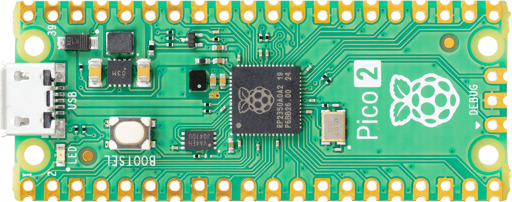

# Real-Time Systems 

This repository contains the practices carried out in the real-time systems discipline carried out in 2025.1. The Raspberry Pi Pico 2 was used.

## 📌 The course covered the following topics:
    1. Introduction to real-time systems.
    2. Characteristics and functionalities of RTOS.
    3. Multicore microcontrollers.
    4. Embedded heterogeneous systems.
    5. Introduction to FreeRTOS.
    6. Task management.
    7. Task states in FreeRTOS.
    8. Communication between tasks.
    9. Interruption and synchronization mechanisms.
    10. Resource management.
    11. Memory management.

Guiding teacher: Francisco Helder Candido dos Santos Filho.

